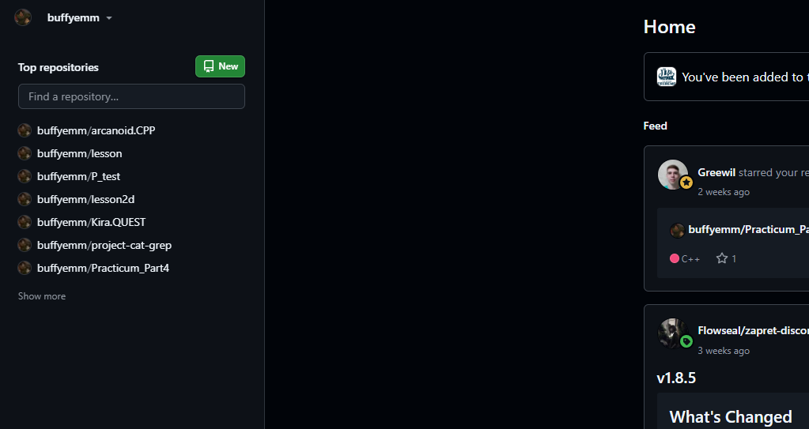
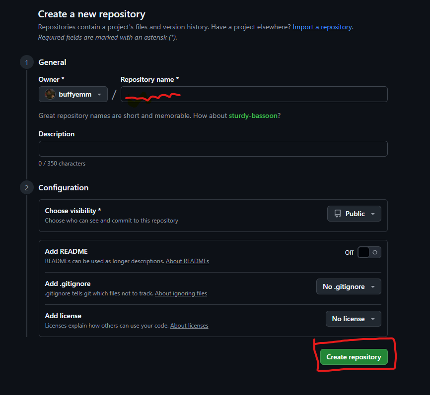
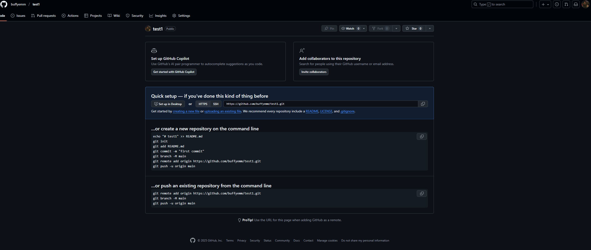
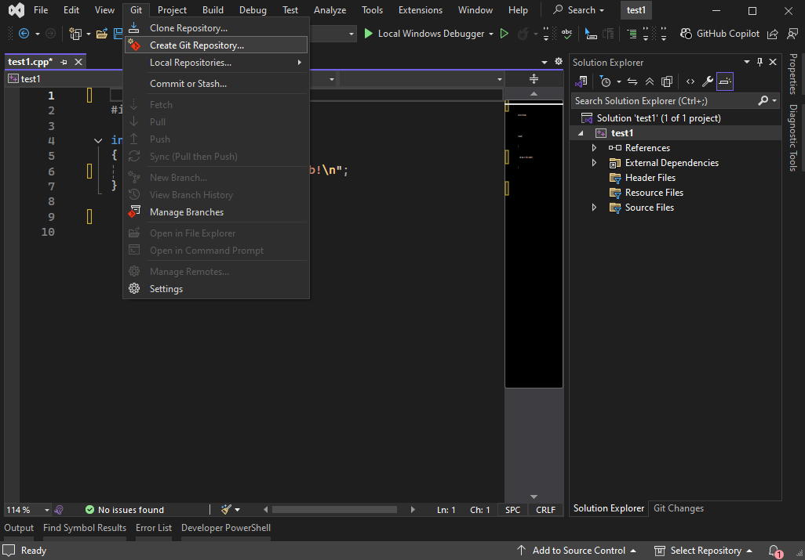

# 📚 Обучение GitHub

## 📖 Методические материалы
Доступ к полной документации по обучению:
[📄 Открыть методическое пособие](https://docs.google.com/document/d/1om947K__I2kWmfEZ1dXwYfzWbCecrz0MVUEBZojgfFA/edit?tab=t.0#heading=h.x4u1bxtik54)

---

## 🆕 Создание репозитория

### Шаг 1: Создание нового репозитория
- Перейдите на главную страницу GitHub
- Нажмите кнопку **`New`**

### Шаг 2: Настройка репозитория
- **Repository Name** - название вашего проекта
- **Visibility** - настройка видимости:
  - `Public` - репозиторий видят все пользователи
  - `Private` - репозиторий доступен только вам

**Рекомендуется выбирать `Public` для учебных проектов**

---

## 🚀 Загрузка проекта в репозиторий

### Шаг 3: Подготовка проекта
После создания репозитория вы увидите следующую страницу:

### Шаг 4: Инициализация Git в проекте
1. Откройте ваш проект в **Visual Studio Community**
2. Перейдите в меню: **Git** → **Create Repository**

---

### Шаг 5 Добавление ссылки Github

## 💬 Поддержка

По всем вопросам обращайтесь:
- **Telegram**: [@likeboshan](https://t.me/likeboshan)
- **Лично**: найти в учебном заведении

---

> ⚠️ **Важно**: Не забудьте сохранить все изменения перед загрузкой в репозиторий!
