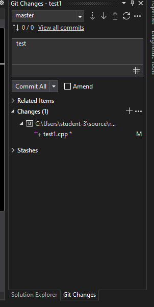

# 📚 Обучение GitHub

## 📖 Методические материалы
Доступ к полной документации по обучению:
[📄 Открыть методическое пособие](https://docs.google.com/document/d/1om947K__I2kWmfEZ1dXwYfzWbCecrz0MVUEBZojgfFA/edit?tab=t.0#heading=h.x4u1bxtik54)

---

## 🆕 Создание репозитория

### Шаг 1: Создание нового репозитория
> 💡 **Примечание**: Если вы работаете на своем компьютере, перейдите к пункту 5.2

- Перейдите на главную страницу GitHub
- Нажмите кнопку **`New`**


### Шаг 2: Настройка репозитория
- **Repository Name** - название вашего проекта
- **Visibility** - настройка видимости:
  - `Public` - репозиторий видят все пользователи
  - `Private` - репозиторий доступен только вам


**Рекомендуется выбирать `Public` для учебных проектов**

---

## 🚀 Загрузка проекта в репозиторий

### Шаг 3: Подготовка проекта
После создания репозитория вы увидите следующую страницу:


### Шаг 4: Инициализация Git в проекте
1. Откройте ваш проект в **Visual Studio Community**
2. Перейдите в меню: **Git** → **Create Repository**


---

## 🔗 Настройка подключения к GitHub

### Шаг 5: Добавление ссылки на GitHub

#### 🏫 Вариант 1: Работа на школьном компьютере

**5.1.1 Создание приватного репозитория**
- Создаем приватный репозиторий на школьной учетке
- Отправляем код в созданный репозиторий


**5.1.2 Изменение удаленного репозитория**
- Переходим: **Git** → **Manage Remotes**


- Здесь указана ссылка, куда отправляется код
- Нажимаем **Edit** и меняем на ссылку вашего репозитория


**5.1.3 Настройка доступа (Collaborators)**
> 🔐 **Важно**: Школьная учетка должна иметь доступ к вашему репозиторию

1. Заходим в ваш репозиторий на GitHub
2. Переходим в **Settings** → **Collaborators**
3. Добавляем школьную учетку по имени пользователя GitHub


**Как найти свою школьную учетку:**
- Наведите курсор на правый верхний угол


**5.1.4 Подтверждение приглашения**
- На школьную учетку придет письмо-приглашение
- Зайдите в GitHub под школьной учеткой
- Примите приглашение


---

#### 💻 Вариант 2: Работа на личном компьютере

**5.2.1 Настройка учетной записи**
- Зайдите в Visual Studio Community под своей учеткой GitHub
- Убедитесь, что вы авторизованы под правильным аккаунтом


**5.2.2 Создание репозитория**
- **Git** → **Create Repository**
- Убедитесь, что выбран ваш аккаунт
- Измените настройки приватности с `Private` на `Public`

---

## 📤 Отправка изменений на GitHub

### Процесс отправки изменений:

1. **Внесите изменения** в код (добавьте отступ или комментарий)
2. Откройте меню **Git**



3. **Напишите комментарий** и нажмите `Commit All`


4. **Нажмите кнопку `Push`**


5. **Проверьте результат** - изменения должны отобразиться на GitHub

> 📝 **Комментарии** нужны для фиксации изменений и будут отображаться на GitHub


---

## 📥 Получение изменений с GitHub

### Ситуация 1: Стандартное обновление
**Когда использовать**: У вас есть проект на личной машине, вы в школе написали новый код и отправили изменения на GitHub. Придя домой, нужно подтянуть все изменения.

1. Откройте проект в Visual Studio Community
2. Нажмите кнопку **`Pull`**


> ✅ **Результат**: Все изменения подтянутся с GitHub, проект будет актуальным

### Ситуация 2: Конфликт версий
**Когда использовать**: Вы писали код дома, отправили на GitHub, потом в школе работали со старой версией кода, изменили его и хотите запушить.

1. Вместо обычного Push нажмите кнопку:
   


> 🔄 **Что произойдет**: 
> - Система скачает актуальную версию с GitHub
> - Объединит ваши изменения с текущей версией
> - Отправит объединенный результат на GitHub

---

## 📥 Клонирование репозитория

### Как склонировать проект на другую машину:

1. **Откройте ваш репозиторий** в браузере
2. **Нажмите кнопку `Code`** и скопируйте ссылку


3. **В Community**: Clone Repository → вставьте ссылку → **ENTER**


🎉 **Поздравляем! Вы склонировали проект**

### После внесения изменений:
Повторите процесс отправки:
- Git меню → Комментарий → Commit All → Push

> 🔍 **Проверьте**: Какая учетка активна на компьютере. Если не ваша - добавьте ее в Collaborators

---

## 🔄 Рабочий цикл Git

### 📍 Рекомендуемый порядок работы:

```bash
# Перед началом работы всегда делайте:
1. Pull  # Получить свежие изменения

# После внесения изменений:
2. Commit  # Зафиксировать изменения
3. Push    # Отправить на GitHub

```

## 💬 Поддержка

По всем вопросам обращайтесь:
- **Telegram**: [@likeboshan](https://t.me/likeboshan)
- **Лично**: найти в учебном заведении

---

> ⚠️ **Важно**: Не забудьте сохранить все изменения перед загрузкой в репозиторий!